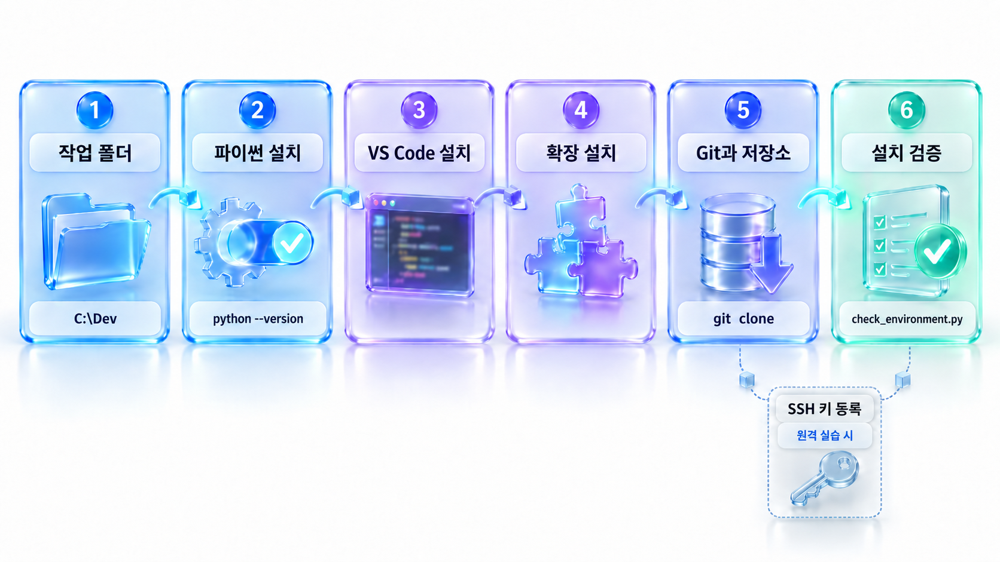
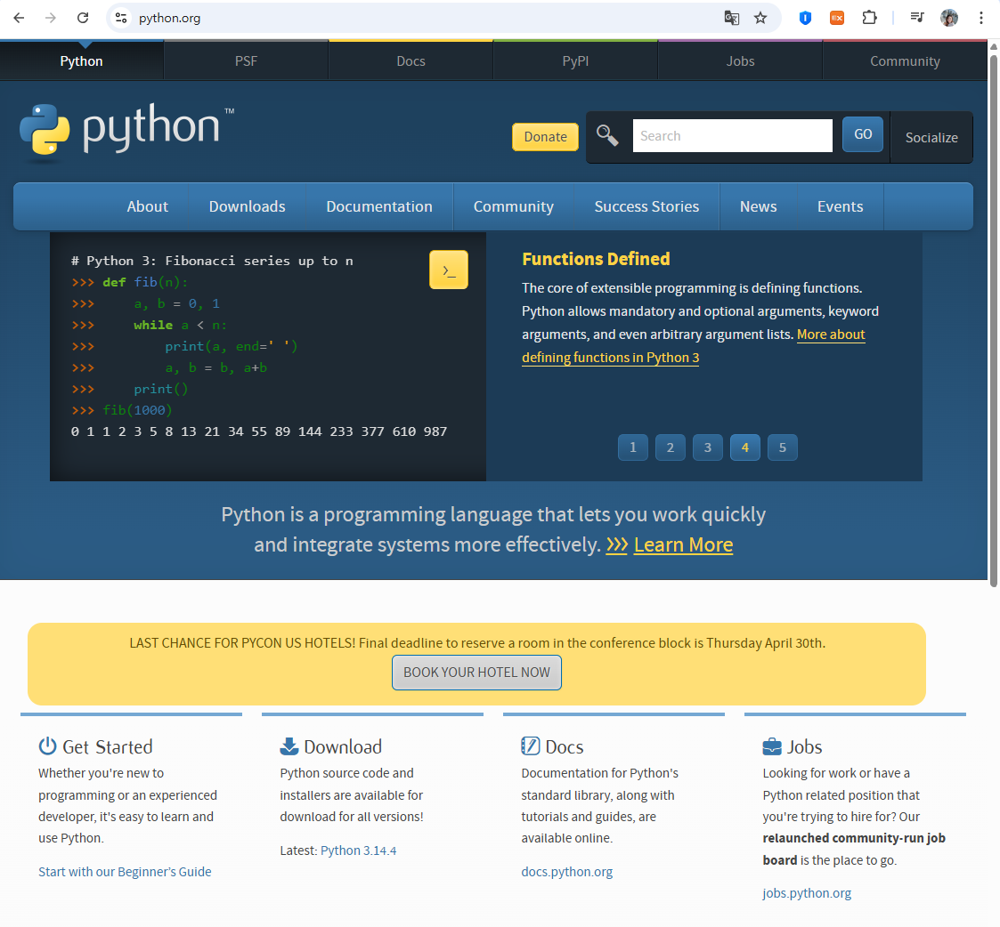
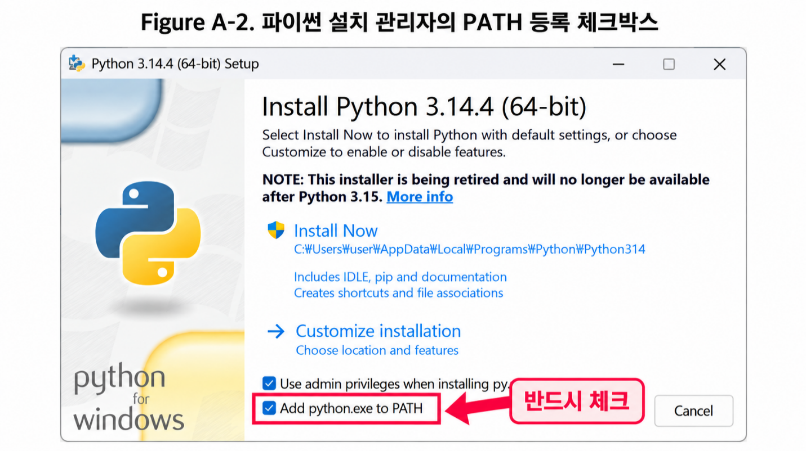
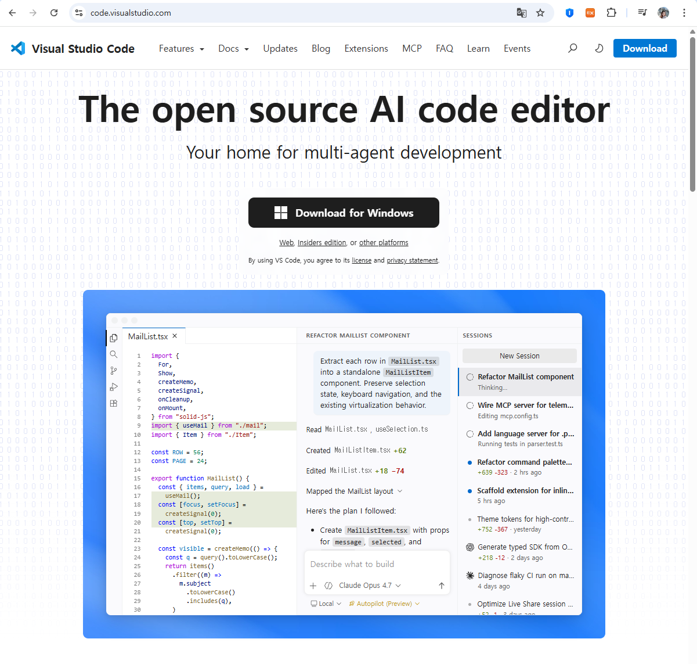
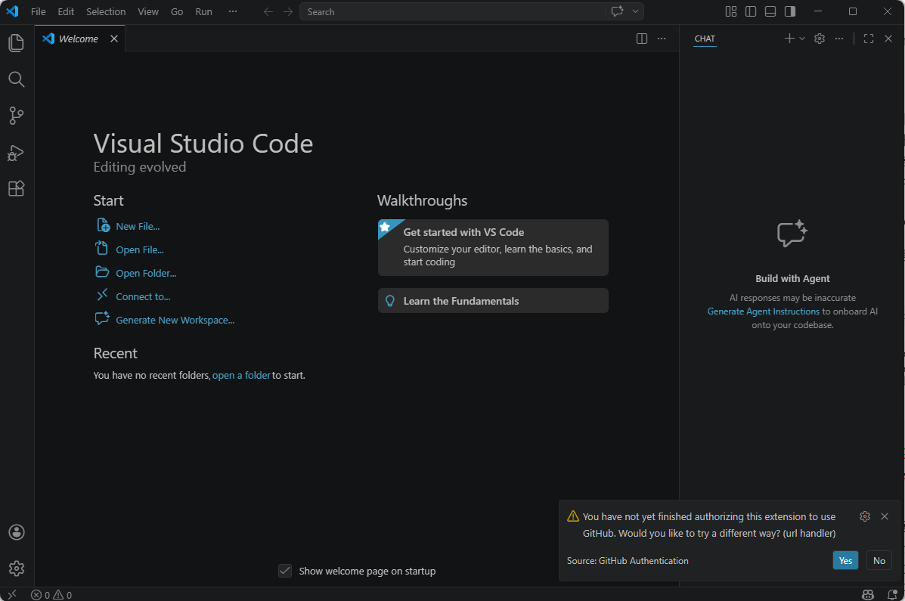
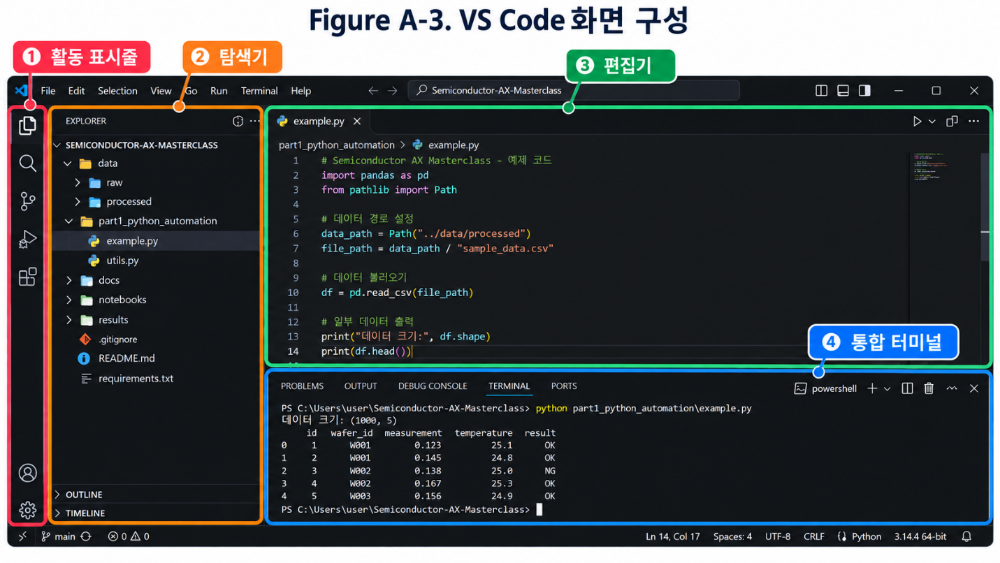
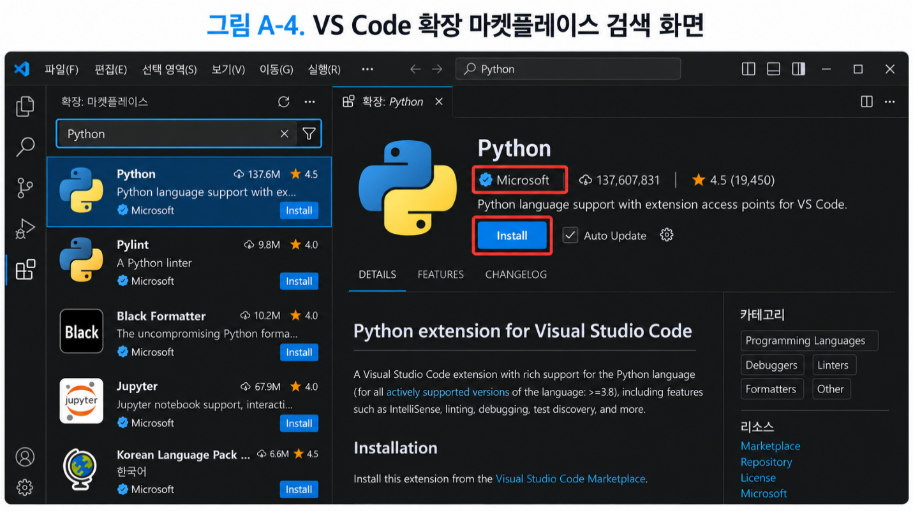
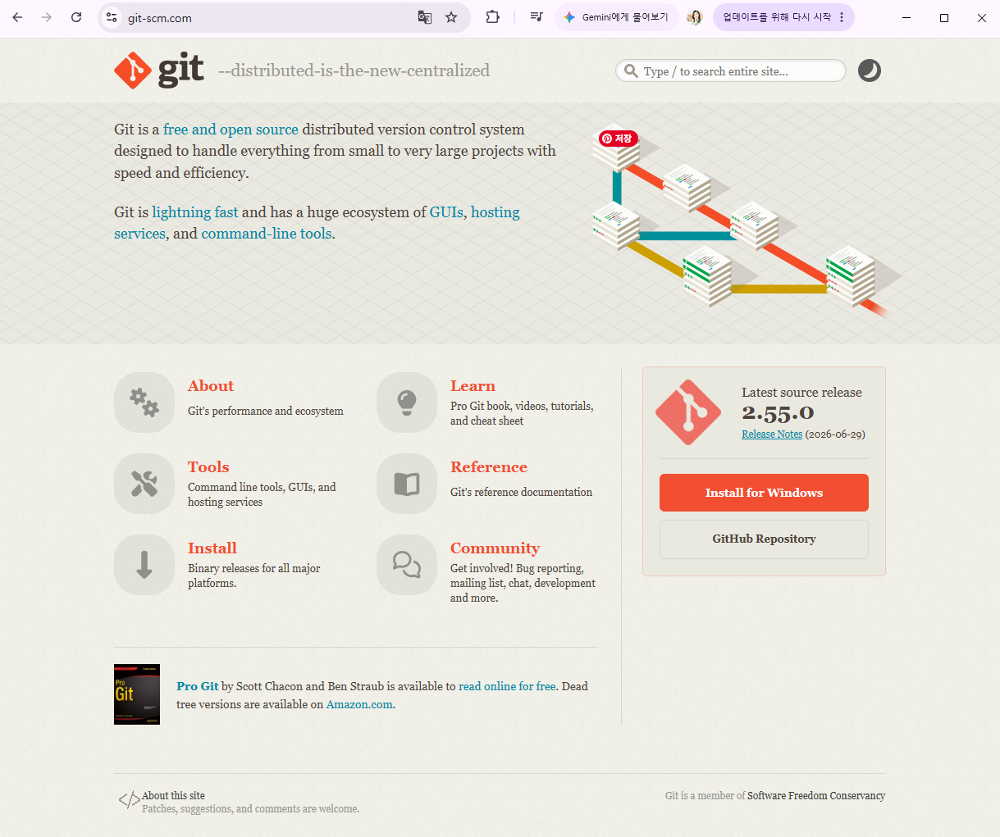

# 부록 A-1. 실습 환경 설치: 파이썬·VS Code·Git 준비와 설치 검증

> [온라인 부록 A] 실습 준비 · 최종 갱신 2026-09-30

> **[온라인 제공 안내]**
>
> 이 부록은 온라인으로 제공한다. 설치 화면과 버전 표기는 갱신 주기가 짧아 인쇄본과 어긋나기 쉽기 때문이다. 공식 저장소의 README에서 최신본 위치를 확인할 수 있으며, 도구 버전이 올라가면 이 문서도 함께 갱신된다.

본문 1장에 들어가기 전에 실습 환경을 갖춘다. 파이썬 엔진을 설치하고 VS Code 도구 사슬을 연동하는 일은 모든 자동화 작업의 0순위 전제 조건이다. 이 단계에서 어긋나면 이후의 어떤 코드도 실행되지 않는다.

프로그래밍이 처음이라면 설치 과정에서 마주치는 용어와 화면이 낯설 수 있다. 이 부록은 클릭 한 번, 명령 한 줄 단위로 설명하며 각 단계가 왜 필요한지도 함께 밝힌다. 순서대로 따라 하면 30분에서 1시간 안에 마칠 수 있다.



*그림 A-1-1 실습 환경 구축 전체 흐름*

**표 A-1-1 설치할 도구와 역할**

| 도구 | 버전 기준 | 역할 | 처음 쓰는 곳 |
|---|---|---|---|
| Python | 3.14 (최소 3.12) | 분석 스크립트를 실행하는 엔진 | 1.2절 |
| Visual Studio Code | 최신 안정판 | 코드 작성·디버깅·원격 접속 환경 | 1.2절 |
| Git | 2.40 이상 | 실습 코드 저장소 내려받기와 버전 관리 | 1.2절 |

설치 순서는 작업 폴더 준비 → 파이썬 → VS Code → Git이다. 파이썬을 먼저 설치해야 VS Code가 인터프리터를 자동으로 찾아 준다.

## A-1.1 작업 폴더 정하기

설치보다 먼저 정할 것이 있다. 실습 파일을 어디에 둘 것인가다. 사소해 보이지만 경로를 잘못 잡으면 나중에 원인을 찾기 어려운 오류가 생긴다. 이 책은 다음 경로를 표준으로 삼는다.

**Path  |  이 책의 표준 작업 폴더 (윈도우 기준)**

```
C:\Dev\Semiconductor-AX-Masterclass
```

본문과 부록의 모든 설명이 이 경로를 기준으로 하므로, 특별한 사정이 없다면 그대로 따르기를 권한다. 화면에 보이는 경로가 책과 같으면 문제가 생겼을 때 비교하기 쉽다. macOS와 리눅스라면 홈 디렉터리 아래에 ~/Dev/Semiconductor-AX-Masterclass로 만든다.

### 왜 이 위치인가

작업 폴더 경로에는 세 가지 함정이 있다. 공교롭게도 셋 다 초보자가 가장 많이 쓰는 위치에서 발생한다.

- **한글과 공백**: 경로에 한글이나 공백이 들어가면 일부 도구가 이를 제대로 처리하지 못한다. 오류 메시지도 친절하지 않아 원인을 찾는 데 시간이 걸린다. C:\사용자\1. 작업 자료\프로젝트 같은 경로는 한글과 공백과 점을 모두 담고 있어 특히 위험하다.

클라우드 동기화 폴더: 바탕 화면이나 문서 폴더는 OneDrive 같은 동기화 서비스의 대상인 경우가 많다. 1.3절에서 만들 가상환경은 파일 수만 개로 이루어지는데, 동기화 프로세스가 이 파일들을 계속 붙잡아 설치가 느려지거나 잠금 오류가 난다.

긴 경로: 윈도우는 전통적으로 경로 길이를 260자로 제한한다. 깊은 곳에 폴더를 두면 그 아래 라이브러리 파일의 경로가 제한을 넘겨 설치가 실패할 수 있다.

**표 A-1-2 작업 폴더 경로의 좋은 예와 피해야 할 예**

| 구분 | 경로 예시 | 판단 |
|---|---|---|
| 권장 | C:\Dev\Semiconductor-AX-Masterclass | 짧고 영문이며 동기화 대상이 아니다 |
| 가능 | D:\Dev\Semiconductor-AX-Masterclass | 다른 드라이브도 조건만 맞으면 무방하다 |
| 피함 | C:\Users\사용자\Desktop\실습 | 한글이 섞이고 동기화 폴더일 가능성이 높다 |
| 피함 | C:\작업\1. Work Data\50. 출판\Python_VS Code\\... | 공백과 점, 한글이 섞이고 경로가 길다 |
| 피함 | C:\ | 루트에는 쓰기 권한 제한이 걸릴 수 있다 |

### 폴더 만드는 방법

1. 파일 탐색기를 열고 좌측에서 "내 PC"를 누른 뒤 C 드라이브를 연다.
1. 빈 공간에서 마우스 오른쪽 버튼을 눌러 새로 만들기 → 폴더를 선택하고 이름을 Dev로 짓는다.
1. 저장소 폴더는 직접 만들지 않는다. A-1.6에서 클론하면 Dev 폴더 아래에 자동으로 생성된다.

> **[이미 내려받았다면]**
>
> 이미 다른 위치에 저장소를 내려받았다면 폴더를 통째로 C:\Dev 아래로 옮기면 된다. 다만 폴더 안에 .venv라는 이름의 폴더가 있다면 그것만은 삭제하고 1.3절에서 새로 만든다. 가상환경 내부의 실행 스크립트와 경로 정보가 이전 위치를 가리킬 수 있어 정상 동작을 보장할 수 없기 때문이다.

## A-1.2 터미널 사용법 익히기

설치 과정에서 터미널을 여러 번 쓴다. 터미널은 마우스 대신 글자로 컴퓨터에 명령을 내리는 창이다. 윈도우에서는 PowerShell, macOS와 리눅스에서는 기본 터미널 앱을 쓴다. 세 가지만 알면 이 부록을 따라오는 데 충분하다.

### 터미널 여는 법

윈도우는 시작 메뉴에서 PowerShell을 검색해 실행한다. 파일 탐색기에서 원하는 폴더를 연 뒤 주소 표시줄에 powershell을 입력하고 엔터를 눌러도 된다. 이 방법을 쓰면 그 폴더에서 바로 시작되므로 이동 명령을 따로 입력할 필요가 없다.

### 프롬프트 읽는 법

터미널을 열면 아래와 비슷한 줄이 보인다. 이 줄을 프롬프트라고 하며, 표시된 경로가 현재 작업 중인 폴더다. 명령은 이 폴더를 기준으로 실행된다.

**Output  |  PowerShell 시작 직후의 프롬프트 (경로는 환경마다 다르다)**

```
PS C:\Users\사용자명>
```

여기서 명령을 실행하면 C:\Users\사용자명 폴더가 기준이 된다. 저장소 폴더의 파일을 다루려면 먼저 그 폴더로 이동해야 한다. 본문에서 "저장소 루트에서 실행한다"는 말은 프롬프트가 저장소 폴더를 가리키는 상태에서 명령을 입력하라는 뜻이다.

**표 A-1-3 이 책에서 쓰는 기본 터미널 명령**

| 명령 | 하는 일 | 예시 |
|---|---|---|
| cd 경로 | 지정한 폴더로 이동한다 | cd C:\Dev\Semiconductor-AX-Masterclass |
| cd .. | 한 단계 위 폴더로 이동한다 | cd .. |
| pwd | 현재 폴더의 전체 경로를 출력한다 | pwd |
| ls | 현재 폴더의 파일 목록을 보여 준다 | ls |
| cls | 화면을 지운다 | cls |

폴더 이름에 공백이 있으면 경로 전체를 큰따옴표로 감싸야 한다. 작업 폴더에 공백을 두지 말라고 한 이유가 여기에도 있다.

### 복사와 붙여넣기

이 부록의 명령은 직접 입력하지 않고 복사해 붙여 넣어도 된다. PowerShell에서는 마우스 오른쪽 버튼을 누르면 클립보드의 내용이 붙여 넣어지며, Ctrl+V도 동작한다. 오타로 인한 실패를 줄이려면 복사해 쓰는 편이 안전하다.

명령을 입력한 뒤에는 반드시 엔터를 눌러야 실행된다. 실행 중에는 커서가 멈춘 것처럼 보일 수 있는데, 설치 명령은 수십 초가 걸리기도 하므로 기다린다. 다시 프롬프트가 표시되면 명령이 끝난 것이다.

### PowerShell 스크립트 실행 제한

1.3절에서 가상환경을 활성화할 때 윈도우 PowerShell이 명령을 거부하는 경우가 있다. 메시지에 "이 시스템에서 스크립트를 실행할 수 없으므로"라는 문구가 보이면, 설치가 잘못된 것이 아니라 PowerShell이 스크립트 파일의 실행을 기본적으로 제한하고 있기 때문이다. 다음 명령으로 현재 터미널에서만 실행을 허용한 뒤 활성화 명령을 다시 입력한다.

**Terminal  |  윈도우 PowerShell에서 실행**

```
Set-ExecutionPolicy -Scope Process -ExecutionPolicy RemoteSigned
```

이 설정은 현재 터미널 창에만 적용되며, 창을 닫으면 원래대로 돌아간다. 시스템 전체의 보안 설정은 바꾸지 않는다. 회사 PC에서 이 명령까지 막혀 있다면 전산 담당 부서에 문의한다.

## A-1.3 파이썬 설치와 환경 변수(PATH) 설정

파이썬은 이 책에서 다루는 모든 자동화 스크립트의 심장부다. 윈도우 환경에서 가장 치명적인 실수는 설치 첫 화면에서 환경 변수(PATH) 등록을 누락하는 것이다. 체크 하나가 빠지면 설치는 성공했는데 터미널에서는 파이썬을 찾지 못하는 상태가 된다.

### PATH란 무엇인가

운영체제는 터미널에 입력된 명령어를 실행할 때, 그 이름의 프로그램이 컴퓨터 어디에 있는지 전부 뒤지지 않는다. 대신 PATH라는 이름의 목록에 등록된 폴더만 순서대로 훑는다. 파이썬이 설치된 폴더가 이 목록에 없으면 운영체제는 python이라는 이름을 해석하지 못하고 명령을 찾을 수 없다고 응답한다. 프로그램이 없는 것이 아니라 어디를 봐야 할지 모르는 상태다.

설치 관리자의 체크박스 하나가 이 목록에 파이썬 폴더를 자동으로 추가해 준다. 나중에 수동으로 등록할 수도 있지만 과정이 번거로우므로 설치 시점에 챙기는 편이 낫다.

### 윈도우 설치 절차

1. 웹 브라우저로 python.org에 접속해 상단 Downloads 메뉴를 누른다. 운영체제를 자동으로 인식해 최신 안정판(Stable Release) 내려받기 버튼이 표시된다.
1. 내려받은 설치 파일을 두 번 눌러 실행한다. 보안 경고가 뜨면 실행을 허용한다.
1. 첫 화면 하단에 체크박스 두 개가 있다. 이 가운데 "Add python.exe to PATH"를 반드시 체크한다. 설치 관리자 버전에 따라 "Add Python 3.x to PATH"로 표기되기도 한다. 기본값이 해제 상태이므로 무심코 넘기기 쉽다.
1. "Install Now"를 눌러 설치를 진행한다. 설치 경로를 바꾸고 싶다면 "Customize installation"을 선택하되, 경로에 한글이나 공백이 들어가지 않게 한다.

"Setup was successful" 문구가 보이면 설치가 끝난 것이다. 화면 하단에 "Disable path length limit" 버튼이 보이면 눌러 둔다. 앞서 설명한 260자 제한을 해제하는 기능이다.




*그림 A-1-2 파이썬 설치 관리자의 PATH 등록 체크박스*

### macOS 설치 절차

python.org에서 macOS용 설치 관리자를 내려받아 실행하면 PATH 설정이 자동으로 이루어진다. 터미널에서는 python3 명령으로 접근한다. macOS에 시스템이나 개발 도구가 관리하는 파이썬이 이미 있더라도 프로젝트 라이브러리를 직접 설치하는 용도로 쓰지 않는다. 이 책에서는 별도로 설치한 파이썬과 가상환경을 사용한다.

### Ubuntu 및 WSL2 설치 절차

배포판 저장소의 기본 파이썬 버전이 이 책의 기준보다 낮은 경우가 많다. 먼저 설치된 버전을 확인한 뒤, 낮다면 별도 저장소를 추가해 설치한다.

**Terminal  |  Ubuntu / WSL2 터미널에서 실행**

```
python3 --version                # 현재 버전 확인
sudo add-apt-repository ppa:deadsnakes/ppa
sudo apt update
sudo apt install python3.14 python3.14-venv
```

python3.14-venv 패키지를 함께 설치해야 한다. 우분투 계열은 가상환경 생성 기능이 별도 패키지로 분리되어 있어, 이것이 없으면 1.3절에서 가상환경을 만들 때 오류가 발생한다. 오류 메시지가 "ensurepip is not available"로 나오면 이 패키지가 빠진 것이다. 조직이 관리하는 서버에서는 임의의 외부 저장소를 추가하지 말고 관리자 정책을 따른다.

### 설치 무결성 검증

터미널을 새로 열고 아래 명령을 실행한다. 설치 직후 이미 열려 있던 터미널에는 PATH 변경이 반영되지 않으므로 반드시 새 창을 연다. 이 사실을 모르면 설치를 제대로 하고도 실패했다고 오해하기 쉽다. 아래는 윈도우 기준이며, macOS·리눅스에서는 python 대신 python3를 입력한다. 가상환경을 활성화한 뒤에는 모든 운영체제에서 python으로 통일된다.

**Terminal  |  로컬 PC 터미널에서 실행**

```
python --version
python -c "import sys; print(sys.executable)"
```

**Output  |  검증 환경에서 실행한 결과 (경로는 환경마다 다르다)**

```
Python 3.14.4
C:\Users\사용자명\AppData\Local\Programs\Python\Python314\python.exe
```

첫 줄의 버전 번호가 출력되면 운영체제가 파이썬 엔진을 정확히 찾고 있다는 뜻이다. 둘째 줄은 실제로 실행된 파이썬 파일의 절대 경로를 보여 준다. 윈도우라면 C:\Users\사용자명\AppData\Local\Programs\Python\Python314\python.exe와 비슷한 경로가 출력된다.

경로를 확인하는 습관은 앞으로 반복해서 쓰인다. 1.2절에서는 원격 서버의 어떤 파이썬이 코드를 실행하는지 판별하는 데 쓰이고, 1.3절에서는 가상환경이 제대로 활성화되었는지 확인하는 기준이 된다. 여러 버전이 설치된 환경에서 어떤 파이썬이 동작하는지 알아내는 가장 확실한 방법이다.

### 자주 겪는 문제

**표 A-1-4 파이썬 설치 후 흔한 오류와 해결**

| 증상 | 원인 | 해결 |
|---|---|---|
| "python은(는) 내부 또는 외부 명령..." | PATH 미등록, 또는 터미널을 새로 열지 않음 | 터미널을 새로 연다. 그래도 같으면 설치 파일을 다시 실행해 Modify에서 PATH를 추가한다 |
| 명령을 입력하면 Microsoft Store가 열림 | 윈도우 앱 실행기가 명령을 가로챈다 | 설정 → 앱 → 앱 실행 별칭에서 python 항목을 끈다 |
| 설치한 것과 <br>다른 버전이 표시됨 | 이전 버전이 PATH 목록 앞쪽에 있다 | py -3.14 로 버전을 지정하거나 시스템 환경 변수에서 PATH 순서를 조정한다 |
| pip을 찾을 수 없다고 나옴 | 설치 시 pip 옵션이 누락되었다 | python -m ensurepip --upgrade 를 실행한다 |
| 권한 오류로 설치가 중단됨 | 설치 위치에 <br>쓰기 권한이 없다 | 설치 파일을 마우스 오른쪽 버튼으로 눌러 <br>관리자 권한으로 실행한다 |

## A-1.4 VS Code 설치와 화면 익히기



VS Code 자체는 빈 도화지에 가깝다. 설치한 뒤 확장을 장착해야 비로소 데이터 분석에 쓸 수 있는 개발 환경이 된다.

1. code.visualstudio.com에 접속해 운영체제에 맞는 설치 파일을 내려받아 실행한다.
1. 설치 옵션 화면에서 "PATH에 추가" 항목을 켜 둔다. 터미널에서 code 명령으로 폴더를 열 수 있게 해 주는 설정이다.
1. "탐색기 상황에 맞는 메뉴에 Code로 열기 추가" 항목도 켜 두면, 탐색기에서 폴더를 마우스 오른쪽 버튼으로 눌러 바로 열 수 있어 편하다.




*그림 A-1-3 VS Code 화면 구성*

### 화면 구성

처음 실행하면 화면이 복잡해 보이지만, 이 책에서 쓰는 영역은 네 곳뿐이다.

- **활동 표시줄(좌측 세로 아이콘 띠)**: 탐색기, 검색, 형상 관리, 디버그, 확장으로 전환하는 버튼이 모여 있다.
- **탐색기(좌측 패널)**: 현재 열어 둔 폴더의 파일 목록이 보인다. 파일을 눌러 편집기에서 연다.
- **편집기(가운데)**: 코드를 작성하는 영역이다.
- **통합 터미널(하단)**: Ctrl+\` 를 누르면 나타난다. 별도 창을 띄우지 않고 편집기 안에서 명령을 실행할 수 있으며, 현재 열어 둔 폴더에서 자동으로 시작된다. 이 책의 실습은 대부분 이 터미널에서 이루어진다.

VS Code는 파일이 아니라 폴더 하나를 작업 공간(Workspace)으로 잡고 그 안의 설정을 따른다. 파일 하나만 열어 두면 프로젝트 설정과 인터프리터 지정이 적용되지 않는다. 반드시 저장소 폴더 자체를 열어야 하며, 1.2절에서 다루는 .vscode/settings.json도 이 규칙 위에서 동작한다.

## A-1.5 확장(Extension) 설치

활동 표시줄의 확장 아이콘을 누르거나 Ctrl+Shift+X를 눌러 마켓플레이스를 연다. 검색창에 이름을 입력하고 결과에서 Install 버튼을 누르면 설치된다. 이름이 비슷한 확장이 많으므로 게시자를 확인하고 설치하는 편이 안전하다.

**표 A-1-5 설치할 VS Code 확장**

| 확장 이름 | 게시자 | 역할 | 필수 여부 |
|---|---|---|---|
| Python | Microsoft | 인터프리터 연동, 디버깅, 언어 서버(Pylance) 구동 | 필수 |
| Pylint | Microsoft | 코드 품질 검사(Linter). 1.2절에서 설정한다 | 필수 |
| Black Formatter | Microsoft | 코드 서식 자동 통일(Formatter). 1.2절에서 설정한다 | 필수 |
| Remote - SSH | Microsoft | 원격 서버 접속 개발. 1.2절 실습의 전제 | 원격 실습 시 |
| Jupyter | Microsoft | 셀 단위 실행과 데이터 확인. 4장 이후 탐색적 분석에 유용 | 권장 |
| Korean Language Pack | Microsoft | 편집기 인터페이스 한글화 | 선택 |



*그림 A-1-4 VS Code 확장 마켓플레이스 검색 화면*

> **[원격 실습 시 주의]**
>
원격 서버에서 실습하는 경우 확장은 로컬이 아니라 원격 쪽에 설치해야 한다. Remote-SSH로 접속한 상태에서 확장 목록을 열면 "Install in SSH: 호스트명" 버튼이 나타나며, 이 버튼을 눌러야 서버의 파이썬을 인식한다. Remote - SSH 확장 자체만 로컬에 설치한다. 자세한 내용은 1.2절 ②에서 다룬다.

## A-1.6 Git 설치와 저장소 클론

실습 코드와 데이터 생성 스크립트는 공식 저장소에서 내려받는다. 압축 파일을 받아도 실습은 가능하지만, Git으로 클론해 두면 이후 코드가 갱신될 때 명령 한 줄로 최신 상태를 받을 수 있다. 이 책의 저장소는 라이브러리 버전 변화에 맞춰 계속 갱신되므로 클론 방식을 권한다.

- 윈도우는 git-scm.com에서 설치 파일을 내려받는다. 설치 옵션이 여러 화면에 걸쳐 나오지만 기본값 그대로 두고 Next를 눌러 진행해도 무방하다.
- macOS는 터미널에서 git --version을 입력하면 설치 안내가 뜬다. Homebrew를 쓴다면 brew install git으로 설치한다.
- Ubuntu 및 WSL2는 sudo apt install git으로 설치한다.

설치 후 최초 1회 사용자 정보를 등록한다. 커밋 이력에 기록되는 정보이며, 등록하지 않으면 첫 커밋 시 오류가 발생한다. 이름과 메일 주소는 본인 것으로 바꿔 입력한다.



**Terminal  |  로컬 PC 터미널에서 실행**

```
git --version
git config --global user.name "Your Name"
git config --global user.email "you@example.com"
```

**Output  |  버전이 출력되면 설치 완료**

```
git version 2.43.0
```

### 저장소 클론

클론 명령은 현재 폴더 아래에 저장소 이름의 폴더를 새로 만든다. 따라서 A-1.1에서 만든 C:\Dev로 먼저 이동한 뒤 실행해야 표준 경로가 완성된다. 마지막 줄의 pwd는 현재 위치를 확인하는 명령이다.

**Terminal  |  로컬 PC 터미널에서 실행**

```
cd C:\Dev
git clone https://github.com/aagicap/Semiconductor-AX-Masterclass.git
cd Semiconductor-AX-Masterclass
pwd
```

**Output  |  마지막 pwd 명령의 출력 (윈도우 PowerShell 기준 예시)**

```
Path
----
C:\Dev\Semiconductor-AX-Masterclass
```

출력된 경로가 표준 경로와 일치하면 클론이 정상적으로 끝난 것이다. 이제 VS Code에서 파일 → 폴더 열기를 눌러 이 폴더를 선택한다.

폴더를 열면 탐색기에 아래와 같은 항목이 보인다. 각 폴더가 교재의 파트에 1:1로 대응한다.

**Output  |  클론 직후 저장소 구성**

```
Semiconductor-AX-Masterclass/
├─ .vscode/          공유 편집기 설정 (1.2절에서 설명)
├─ data/             데이터·리포트 생성 스크립트 (CSV는 실행하면 생성)
├─ extras/           본문 측정값을 재현하는 보조 스크립트
├─ part1_python_automation/   ~ part5_rag_capstone/
├─ .gitignore        형상 관리에서 제외할 대상 목록
├─ check_environment.py
├─ pyproject.toml    서식 규칙과 공통 모듈 설치 설정 (1.2절, 4.1절)
├─ README.md
└─ requirements.txt  설치할 라이브러리 명세
```

.vscode 폴더에는 이 프로젝트를 여는 모든 사람이 같은 규칙으로 작업하도록 하는 편집기 설정이 들어 있다. 지금은 내용을 몰라도 되며, 온라인 교재 부가 설명 자료 1.2절에서 항목별로 설명한다. 파일을 지우거나 고치지 않는다.

data 폴더에는 아직 통합 데이터셋(CSV)이 없다. 데이터는 저장소에 파일로 넣지 않고 생성 스크립트로 제공하며, 1.3절에서 라이브러리를 설치한 뒤 스크립트를 실행해 만든다(일러두기 3절). 같은 스크립트로 만들기 때문에 누구의 컴퓨터에서나 같은 데이터가 생긴다.

> **[앞으로 생길 폴더]**
>
> 실습을 진행하면 여기에 .venv 폴더가 하나 더 생긴다. 프로젝트 전용 파이썬 환경을 담는 폴더이며 1.3절에서 만든다. 이 책에서는 이름을 .venv로 통일한다. 저장소의 VS Code 설정이 이 경로를 기준으로 하기 때문이다. 다른 이름을 쓰면 책의 기본 설정이 그 환경을 가리키지 않으므로 인터프리터를 직접 선택해야 한다. 이 폴더는 .gitignore에 등록되어 있어 형상 관리 대상에서 자동으로 제외된다.

윈도우에서 작업한다면 줄바꿈 문자 자동 변환 때문에 형상 관리 이력이 지저분해질 수 있다. 저장소의 .vscode/settings.json이 편집기 쪽 줄바꿈을 고정하고 있으므로 대부분 문제가 없지만, 이력에 공백만 바뀐 변경이 계속 잡힌다면 git config --global core.autocrlf input 설정을 확인한다.

## A-1.7 원격 접속용 SSH 키 등록 (원격 실습 시)

> **[해당 여부 확인]**
>
> 이 항은 원격 분석 서버에서 실습하는 독자만 해당한다. 로컬 환경에서만 실습한다면 건너뛰고 다음 항으로 넘어간다. 원격 서버가 없어도 이 책의 실습은 로컬 환경에서 진행할 수 있다.

본문 1.2절 ②에서 다룬 키 기반 인증은 두 단계로 이루어진다. 로컬에서 키 쌍을 만들고, 그 가운데 공개 키만 서버에 등록하는 것이다. 개인 키는 로컬을 떠나지 않는다.

리눅스와 macOS에는 공개 키를 서버에 등록해 주는 명령이 기본으로 들어 있지만, 윈도우에는 없다. 따라서 절차가 나뉜다. 어느 쪽이든 키 쌍 생성은 동일하다.

키 쌍 생성

로컬 PC의 터미널에서 실행한다. 윈도우 PowerShell, macOS, 리눅스 모두 같다.

**Terminal  |  로컬 PC 터미널에서 실행 (공통)**

```
ssh-keygen -t ed25519 -C "engineer@alphachip"
```

실행하면 저장 위치와 패스프레이즈를 묻는다. 저장 위치는 엔터를 눌러 기본값을 그대로 쓴다. 기본 경로는 사용자 홈 디렉터리 아래 .ssh 폴더다.

패스프레이즈는 개인 키 파일에 걸어 두는 암호다. 비워 두면 접속할 때마다 입력하지 않아도 되지만, 개인 키 파일이 유출되면 그것만으로 서버에 접속할 수 있게 된다. 업무용 서버라면 설정하기를 권한다.

완료되면 .ssh 폴더에 파일 두 개가 생긴다.

**표 A-1-6 생성된 키 쌍**

| 파일 | 구분 | 취급 |
|---|---|---|
| id_ed25519 | 개인 키 | 로컬에만 보관한다. <br>누구에게도 전달하지 않고 형상 관리에 올리지 않는다 |
| id_ed25519.pub | 공개 키 | 서버에 등록한다. 전달해도 무방하다 |

확장자가 .pub인 것이 공개 키다. 두 파일을 혼동해 개인 키를 서버에 올리거나 메일로 전달하는 일이 실무에서 드물지 않게 일어난다. 등록할 때 파일명 끝의 .pub를 반드시 확인한다.

공개 키 등록 — Linux / macOS

전용 명령이 있어 한 줄로 끝난다. 서버 계정의 비밀번호를 한 번 입력하면 공개 키가 등록되고, 이후 접속에는 비밀번호가 필요하지 않다.

**Terminal  |  Linux / macOS 터미널에서 실행**

```
ssh-copy-id -i ~/.ssh/id_ed25519.pub fab-analysis
```

fab-analysis는 본문 1.2절 ②에서 설정 파일에 적은 별칭이다. 설정 파일을 만들지 않았다면 계정@서버주소 형태로 적는다.

공개 키 등록 — 윈도우

윈도우에는 위 명령이 기본으로 포함되지 않는다. 공개 키의 내용을 서버의 authorized_keys 파일에 직접 추가한다. 세 단계다.

### 1단계. 공개 키 내용 확인

**Terminal  |  윈도우 PowerShell에서 실행**

```
Get-Content $env:USERPROFILE\.ssh\id_ed25519.pub
```

ssh-ed25519로 시작하는 한 줄이 출력된다. 이 줄 전체를 복사한다. 중간에 줄바꿈이 들어가면 키가 인식되지 않으므로, 터미널 창의 너비를 넓혀 한 줄로 보이는 상태에서 복사하는 편이 안전하다.

### 2단계. 서버에 접속해 파일에 추가

비밀번호로 한 번 접속한 뒤 서버에서 실행한다. 아래 명령의 큰따옴표 안에 1단계에서 복사한 내용을 붙여 넣는다.

**Terminal  |  윈도우 PowerShell에서 실행**

```
ssh engineer@10.20.30.200
```

**Terminal  |  원격 서버 터미널에서 실행**

```
mkdir -p ~/.ssh
echo "ssh-ed25519 AAAA...복사한_내용...engineer@alphachip" \
  >> ~/.ssh/authorized_keys
chmod 700 ~/.ssh
chmod 600 ~/.ssh/authorized_keys
```

리다이렉션 기호를 두 개(>>) 쓰는 것이 중요하다. 하나만 쓰면 기존 내용을 덮어써서 다른 사람이 등록한 키가 사라진다. 마지막 두 줄의 권한 설정을 빠뜨리면 서버가 보안상 위험하다고 판단해 키를 무시하는 경우가 있다.

### 3단계. 접속 확인

서버에서 나온 뒤 다시 접속해 본다. 비밀번호를 묻지 않고 바로 접속되면 등록에 성공한 것이다. 본문 1.2절에서 SSH 설정 파일을 만든 뒤부터는 ssh fab-analysis로 접속할 수 있다.

**Terminal  |  윈도우 PowerShell에서 실행**

```
exit
ssh engineer@10.20.30.200
```

자주 겪는 문제

**표 A-1-7 공개 키 등록 후 흔한 오류와 해결**

| 증상 | 원인 | 해결 |
|---|---|---|
| 여전히 비밀번호를 묻는다 | 공개 키가 등록되지 않았거나 <br>권한 설정이 빠졌다 | authorized_keys 파일의 내용과 앞의 권한 설정 <br>두 줄을 다시 확인한다 |
| "Permission denied (publickey)" | 서버가 비밀번호 인증을 막아 둔 상태에서 키 등록이 실패했다 | 전산 담당 부서에 문의해 비밀번호 인증을 <br>일시 허용받고 등록을 다시 시도한다 |
| 키가 인식되지 않는다 | 복사 과정에서 줄바꿈이 들어갔다 | authorized_keys 파일을 열어 <br>키가 한 줄로 들어갔는지 확인한다 |
| 개인 키를 잘못 등록했다 | .pub 없는 파일을 올렸다 | 서버의 파일을 즉시 지우고 키 쌍을 새로 만든다. 노출된 개인 키는 폐기한다 |

> **[개인 키가 노출되었다면]**
>
개인 키를 서버나 저장소에 올렸다면 그 키는 폐기하고 새로 만든다. 파일을 지우는 것만으로는 이미 노출된 키가 무효화되지 않는다. 1.5절의 API 키와 같은 원칙이다.

등록이 끝나면 본문 1.2절 ②로 돌아가 VS Code에서 원격 접속을 진행한다.

## A-1.8 설치 검증 체크리스트

아래 여섯 항목이 모두 통과하면 1장으로 넘어갈 준비가 끝난 것이다. 하나라도 어긋나면 해당 절로 돌아가 다시 확인한다.

**표 A-1-8 설치 검증 항목**

| 항목 | 확인 방법 | 정상 결과 |
|---|---|---|
| 작업 폴더 | 탐색기에서 C:\Dev 확인 | Semiconductor-AX-Masterclass 폴더가 있다 |
| 파이썬 인식 | python --version | 3.14가 표시되면 정상, <br>최소 3.12 버전 번호가 출력된다 |
| 실행 파일 경로 | python -c "import sys; print(sys.executable)" | 설치한 위치의 절대 경로가 출력된다 |
| Git 인식 | git --version | 2.40 이상 버전 번호가 출력된다 |
| 폴더 연결 | VS Code에서 저장소 폴더 열기 | 탐색기에 data, part1_python_automation <br>등이 보인다 |
| 설정파일 | 탐색기에서 .vscode 폴더 열기 | 안에 settings.json이 들어 있다 |

저장소에는 환경을 한 번에 점검하는 스크립트가 들어 있다. VS Code에서 폴더를 연 뒤 Ctrl+\` 로 통합 터미널을 열고 실행해 본다.

**Terminal  |  저장소 루트에서 실행**

```
python check_environment.py
```

이 시점에는 아직 가상환경을 만들지 않았고 라이브러리도 설치하지 않았으므로, 가상환경 격리와 패키지 항목, ax_ 공통 모듈 항목에 FAIL이 나오는 것이 정상이다. 첫 줄에 파이썬 버전이 3.14(최소 3.12)로 표시되는지만 확인하면 된다. 가상환경 생성과 라이브러리 설치는 1.3절에서, 공통 모듈 설치(pip install -e .)는 4.1절에서 진행한다. 각 단계를 마친 뒤 같은 스크립트를 다시 실행하면 해당 항목이 OK로 바뀐다.

> **[다음 단계]**
>
설치는 여기까지다. 1.2절은 이 환경 위에서 원격 서버에 접속하는 방법을 다루고, 1.3절은 프로젝트 전용 가상환경을 만들어 라이브러리를 격리하는 방법을 다룬다. 지금 시스템 전역에 라이브러리를 설치하지 않는 이유가 1.3절에서 밝혀진다.
